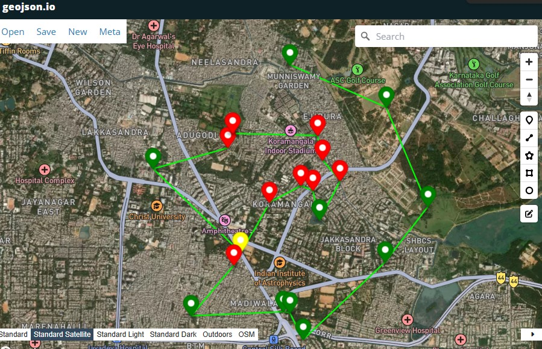

## README.md

# Backend Assignment: Best Route Delivery Optimization

This project helps a delivery executive efficiently plan order deliveries by determining the fastest possible route. The system simulates real-world scenarios involving multiple orders, restaurants, and consumer locations, calculating the best route using the Haversine formula.

***

## Problem Statement

A delivery executive (e.g., Aman) is assigned two orders for delivery. Each order consists of:
- A restaurant location (with average meal preparation time).
- A consumer location.

On assignment, the goal is to calculate the optimal sequence (route) for pickup and delivery, minimizing the total delivery time. Travel times between points are calculated using the Haversine formula, with a constant average speed of 20km/hr.

***

## Project Structure

```plaintext
src/
└── main/
    └── java/
        └── org.example/
            ├── algo/
            │   └── Haversine.java
            ├── dto/
            │   ├── RouteResult.java
            │   └── RouteStep.java
            ├── entity/
            │   ├── Location.java
            │   └── Order.java
            ├── service/
            │   └── RouteService.java
            ├── utility/
            │   ├── GeoJsonExporter.java
            │   └── OrderGenerator.java
            └── App.java
```

***

## Key Components

- **Haversine Algorithm**: Calculates travel time between geo-locations using latitude and longitude.
- **Entities & DTOs**: Models for Orders, Locations, Route steps, and Route results.
- **RouteService**: Orchestrates planning and route calculation logic.
- **Utilities**: Generates orders and exports route details in GeoJSON format.
- **App**: Entry point.


***
## Visualizing the Route GeoJSON

After running the project, a `.geojson` file is generated representing the delivery route with origin, pickups, deliveries, and direction arrows.

**To visualize the route:**
- Visit [https://geojson.io/#map=13.12/12.93604/77.6209](https://geojson.io/#map=13.12/12.93604/77.6209)
- Drag and drop your generated `.geojson` file onto the page.
- The map will show:
   - Yellow marker for the origin
   - Red markers for pickups
   - Green markers for deliveries
   - Route lines and arrows indicating direction

This provides a quick and interactive way to verify your delivery routes without complex setup, as shown below:


## Usage

1. **Setup Dependencies**
    - Java 8+
    - [Maven]/[Gradle]

2. **Build & Run**

   ```shell
   mvn install
   java -jar target/blinkit-backend.jar
   ```

3. **Configure Input**

    - You can input consumer and restaurant locations via the relevant classes (see `OrderGenerator`).

4. **Test Coverage**

    - Classes have extensive method and line coverage (see project coverage summary in IDE).

***

## How It Works

- On receiving an order batch, the system simulates restaurant preparation and delivery timings.
- All actors start simultaneously when orders are assigned.
- The system finds the fastest possible route for pick-up and delivery by modeling preparation and travel times between all geo-locations.

***

## Best Practices

- Code adheres to Java production standards.
- Classes and methods are modular and well-tested.
- Route calculation is abstracted for extensibility (e.g., more orders, dynamic speeds).
- Haversine formula ensures accurate distance computation between geo-points.
- Utilities are provided for exporting route data and generating test orders for CI/CD.

***

## Contributing

- Fork the repo, create a feature branch (`feature/my-feature`), submit a pull request.
- Ensure new code is thoroughly tested and adheres to project structure.


***

## License

MIT

***

## Contact

For questions, reach out via Issues or Email: [vipul07.mathuria@gmail.com]

***

## References

- Haversine formula: https://en.wikipedia.org/wiki/Haversine_formula
- Java backend best practices

***